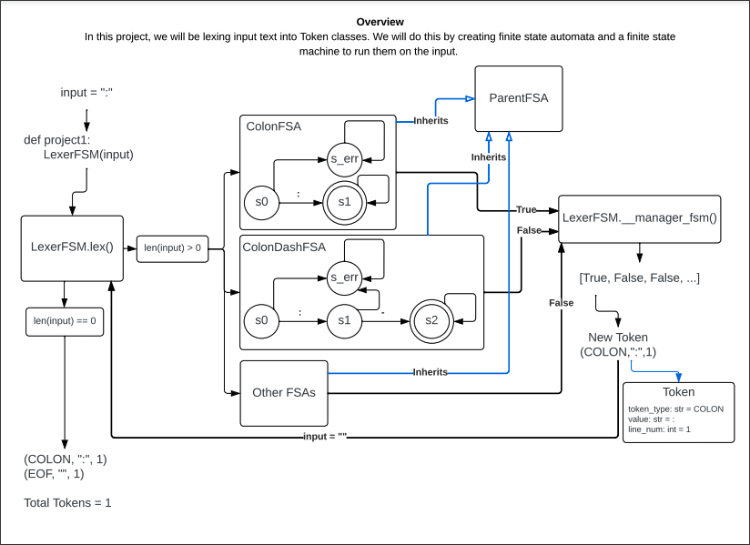

# Project 1
In this project, we will be lexing input text into Token classes. We will do this by creating finite state automata and a finite state
machine to run them on the input.

## Connection to Project 1 Diagram

All of the classes in the diagram are located in the project1_classes package. Here are specifics:
- project1 function: project1.py
- LexerFSM: lexer_fsm.py
- Token: token.py
- Parent FSA: fsa_classes/fsa.py
- ColonDashFSA: fsa_classes/colon_dash_fsa.py
- All other FSAs: will go in the fsa_classes folder

## Where to start
Start by writing the functionality for the Parent FSA class (fsa.py), as well as the ColonDashFSA and ColonFSA (you will have to build your own class for this one). Next, using the Jupyter Notebook as a guide, build out the Lexer logic. All of the funcitons you will need are stubbed out in the lexer_fsm.py file. You should be able to get your ColonDashFSA and ColonFSA working correctly (use your own test case to test it!). From there, build out all the other FSA classes and then you will be done!

## Friendly Reminder
DO NOT edit any of the code or text in test.py, conftest.py, or the project1-passoff folder. Editing these files will result in a failure for the project. TA's and the Professors will be able to see and will be checking what edits you make to these files when you commit to Github.

## Note about python imports 
Python imports are different from other langauges such as C++ and Java. You can't just put files into a folder to organize them. If you want to import a file from another directory, it needs to be part of a python package. That means that the directory or one of its parent directories has the file \_\_init__.py. In this file you can create shortcuts for imports, but for our purposes it will be empty. 

As such, project1_classes is a python package. To import classes to use outside of the package (project1.py for example), use the following structure: 

`from project1_classes.file_name import class_name`

See project1.py for an example of this. To import from the inside the package use something like the following: 

`from .folder_name.file_name import class_name`

See lexer_fsm.py for an example of this. If you need to import a file that isn't in a subdirectory of the package use the following:

`from .file_name import class_name`

Again, see lexer_fsm.py for an example of this.